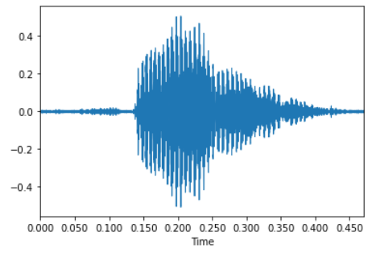
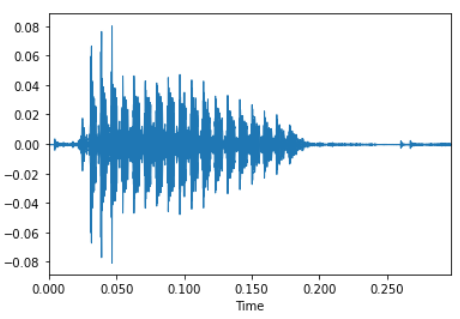
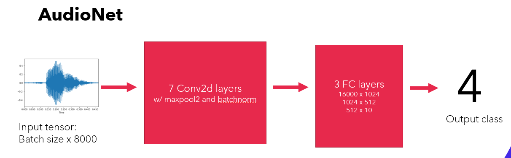
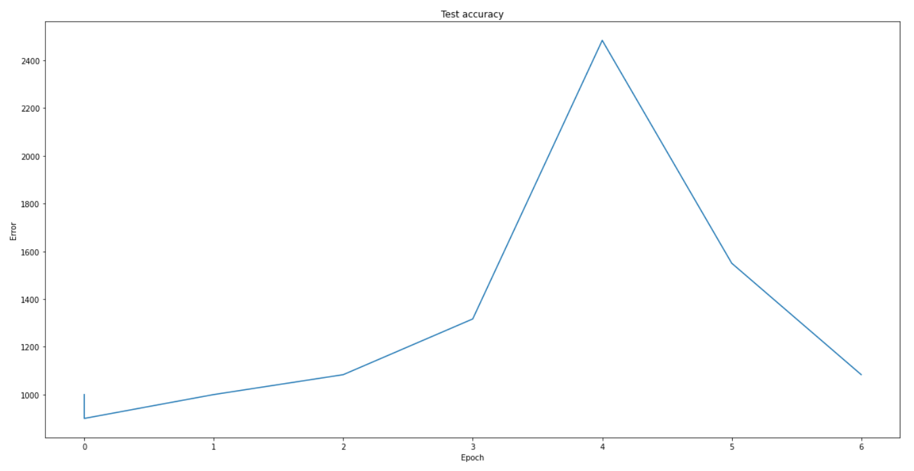
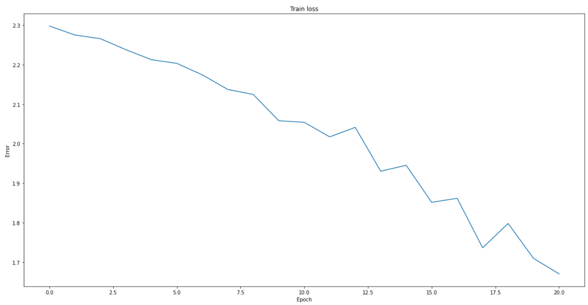
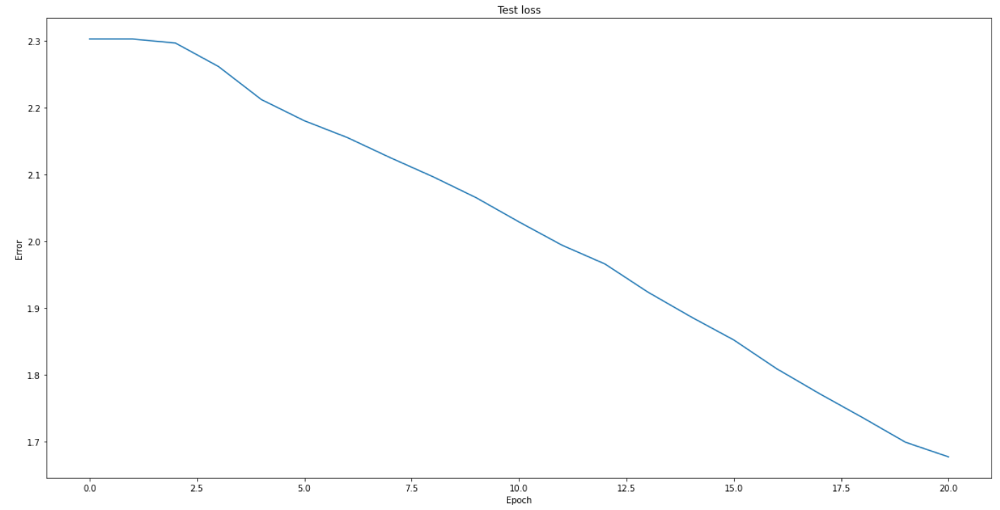
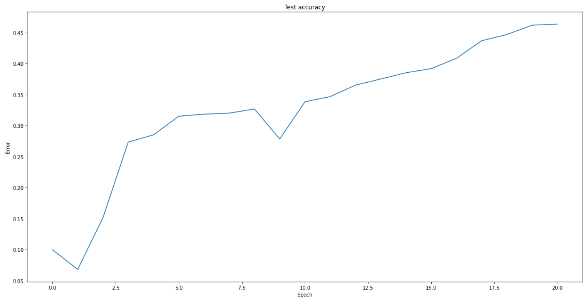

# Automatic Speech Recognition with AudioMNIST
Final project for deep learning

## Video
!(Video link)[https://youtu.be/gH2tbEnTiQc]

## Abstract
For this project, I trained the a convolutional neural network to classify digits spoken in the AudioMNIST dataset. The result was 45% accuracy after 20 epochs, which could easily be improved by training for more epochs.

## Problem Statement
The goal is to be able to predict words being spoken in real-time. Ideally this would require using a RNN, where variable-length data points can continuously be streamed into the network to produce a prediction. For this project, I will start with a small vocabulary size of 10 words and see if I can create a model that predicts the word being spoken.

## Related work

The paper by Becker et al. that created the AudioMNIST dataset already includes a neural network architecture that feeds the entire raw audio signal into the network at once, using an architecture similar to an image classifier to predict which digit from 0-9 is being spoken. They produced a model that takes in the raw audio signals from the AudioMNIST dataset and predicts the spoken digit with over a 90% accuracy.

You can download the AudioMNIST dataset from the Github repository [here](https://github.com/soerenab/AudioMNIST).

The link to the paper by Becker et al. can be found [here](https://arxiv.org/abs/1807.03418).

## Methodology
### Data preparation
The original MNIST data provided spectrograms, raw audio signals, speaker names, and labels for each data point. To prepare the data to be fed into the neural network, I reordered the data by splitting it into groups based on the label. Then within each label group, I scrambled the data points, truncated some of them so no audio signal exceeded a length of 8000, and split each group into train and test data. Finally, I scrambled the resulting train and test sets. The train dataset contains approximately 80% of the overall dataset, while the test dataset contains the remaining 20%.

### AudioNet1 - Convolutional Neural Network

First, I recreated the AudioNet as described in Becker et al. Becker et al. created two different network architectures; one on spectrograms and one on the raw audio signals. The performance of the spectrogram network was slightly better, but I decided to train on the raw audio signal since it seemed more applicable for general use cases.

AudioNet is a convolutional neural network containing nine layers in the following order: conv3-100, conv3-64, conv3-128, conv3-128, conv3-128, conv3-128, conv3-128, FC-1024, FC-512, FC-10. The conv3-100 layer is a convolutional layer with a filter size of 3, 100 output channels, and a stride of 1. Each convolutional layer was followed by a maxpool layer with a kernel size of 2 and stride of 2, and each convolutional layer except for the first was followed by a batchnorm layer. All convolutional and fully connected layer outputs were fed into a ReLU layer.

For model parameters, I used similar parameters as Becker et al. I used stochastic gradient descent with a batch size of 100, a learning rate of 0.0001, and a constant momentum of 0.9. Becker et al. trained their model for 50000 epochs, and decreased the learning rate over time. However, due to reduced time constraints, I only trained my version of AudioNet for 20 epochs without adjusting the learning rate.

For each epoch, I measured the training and test loss, as well as the test accuracy to assess how the model was improving over time. For each batch, I pad the batch elements with zeros so they all have a length of 8000.

### AudioNet2 - Recurrent Neural Network
For the recurrent neural network, I created a much smaller architecture. The data is fed into a Gated Recurrent Unit RNN, then it is sent to a fully connected layer. The batch size for this network was 10, and rather than use a fixed sequence length of 8000, I used Pytorch's pad sequence util function since the audio length does not need to be fixed. This pads all the sequences in the batch with 0s at the end so they are all the same length as the longest sequence in the batch.

## Experiments/Evaluation
Compared to the CNN (convolutional neural net), the RNN (recurrent neural net) took much longer to train, even with a smaller batch size. The CNN took less than 3 minutes per epoch, while the RNN often took 90 minutes per epoch.

While I did not get much time to play around with the RNN model parameters, I got to attempt adjusting some of the CNN parameters. In particular, the CNN accuracy originally was not increasing, but after adding in batchnorm layers, the CNN began to train well, even if inconsistently. I was able to stabilize the training to prevent overfitting by lowering the learning rate and adding momentum of 0.9 to the optimizer. Here were the results before lowering the learning rate:

## Results
By following the CNN model architecture from Becker et al., the model was able to train successfully, increasing accuracy each epoch. Here are the final graphs for that experiment:

As you can see, after just 20 epochs, the test accuracy increases from 10% to 45%. Note that the original paper trained the model for 50000 epochs, much more than what I had time to train. From the patterns of the loss graphs, it seems the model has not yet reached convergence since the line does not flatten. It is very likely that an even greater accuracy could have been achieved by simply increasing the number of epochs.

The RNN model architecture was not as successful, and I was unable to get it above a 10% accuracy (baseline accuracy). Additionally, each epoch took significancly longer to run, so I was unable to tell if running the model for more epochs would increase the model performance. While I was overall very satisfied with the CNN performance, there is a lot to be improved with the RNN, and I hope to continue exploring ways to train audio signals with RNNs in the future.
